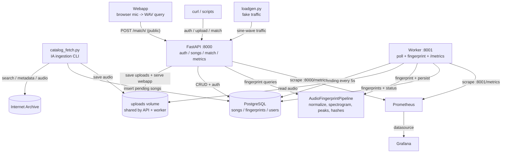

# Shanano — Scalable Audio Fingerprinting

Shanano is a **learning project**: a minimal Shazam clone that gets progressively
turned into a distributed, observable, production-ish system. Each iteration
exists to explore a different engineering topic — with real code, not just
notes.

## Topics explored

| Iteration | Topic | What was built |
|---|---|---|
| 1 | Async Python API + containers | FastAPI REST API, async SQLAlchemy + PostgreSQL, Alembic migrations, a background fingerprinting worker |
| 2 | Observability | Prometheus metrics (`/metrics` on API + worker), a Grafana dashboard, structured JSON logging (structlog) |
| 3 | Orchestration + fake traffic | Plain Kubernetes manifests for the whole stack (kind), and `loadgen`, a fake-traffic generator with sine-wave request rate |
| 4 | Full-stack product | Internet Archive catalog ingestion, JWT auth + roles, real audio matching, a mic-only web app, and a portable offline seed |
| 5 (next) | Event-driven | Async fingerprint processing on Kafka |

## High-level architecture

Audio is **fingerprinted once** — by the worker — and stored as hash/offset rows
in PostgreSQL. A **query** (a mic recording from the webapp, or an uploaded
clip) is fingerprinted the same way, then matched by hash lookup + offset
voting. Catalog songs come from the Internet Archive via `catalog_fetch.py`, or
from the bundled offline seed (`make seed`).



The API has auth-protected song endpoints plus a **public** `POST /match/` so the
mic-only webapp matches anonymously. Prometheus scrapes `/metrics` from the API
and the worker; Grafana renders the dashboard. Component and feature
explanations live in [`docs/`](docs/README.md).

## Run the demo (make commands)

`make` targets wrap the whole demo — no Docker or Postgres needed. It uses a
throwaway local SQLite DB and hits the **real** Internet Archive for the catalog
step. `make help` lists every target.

### Full flow (2 terminals)

```bash
# Terminal 1 — reset the demo DB, then start the API and the worker
make setup       # wipe the throwaway demo DB
make api         # start the API on :8000 (creates schema + seeds admin/loadgen)
make worker      # fingerprint pending songs as they arrive

# Terminal 2 — populate the catalog, then match against it
make catalog     # fetch 1 Internet Archive item (librivoxaudio, small download)
make status      # watch the song flip pending -> processing -> completed
make clip        # cut a 15s WAV clip from the downloaded song
make match       # match the clip (public endpoint) -> full metadata result
```

### Cheat sheet

| Target | What it does |
|---|---|
| `make help` | list all targets |
| `make setup` / `make clean` | reset / remove the demo DB + temp files |
| `make api` / `make worker` | start the API on :8000 / the fingerprinting worker |
| `make catalog` / `make dedupe` | fetch one IA batch / re-run to show "already ingested, skipping" |
| `make songs` / `make status` | list songs with metadata / just id + status + fingerprint count |
| `make auth` | run the 8 auth checks (login, roles, route protection) |
| `make upload` | upload a sample WAV as a song (authed) |
| `make clip` / `make match` / `make negative` | cut a query clip / match it / noise + error cases |
| `make seed` | build the offline seed (ingest links → fingerprint → tar.gz) |
| `make seed-restore` | load the seed into a fresh DB (fully offline demo) |

See [`demo.md`](demo.md) for the full copy-paste walkthrough.

## Also in this repo

- **Webapp** — record ~5–15 s from the browser mic and match anonymously. With
  the API running, open `http://localhost:8000` (spec: `docs/webapp.md`).
- **Docker Compose** — full stack with Postgres, Prometheus, Grafana, pgAdmin
  and loadgen: `docker compose -f infra/docker-compose.yml up -d`.
- **Kubernetes** — plain manifests to run the whole stack on a local kind
  cluster (`k8s/README.md`).
- **Tests** — `pip install -r requirements-dev.txt` then `pytest` (SQLite, no
  Docker needed).

## Services (Docker Compose)

| Service | URL | Credentials |
|---|---|---|
| API | `http://localhost:8000` | — |
| OpenAPI docs | `http://localhost:8000/docs` | — |
| API / worker metrics | `http://localhost:8000/metrics` / `:8001/metrics` | — |
| Prometheus | `http://localhost:9090` | — |
| Grafana | `http://localhost:3000` | `admin` / `shanano` |
| pgAdmin | `http://localhost:5050` | `admin@shanano.dev` / `shanano` |

## License

Educational project. Audio files from the [MUSAN](https://openslr.org/17/)
corpus.
