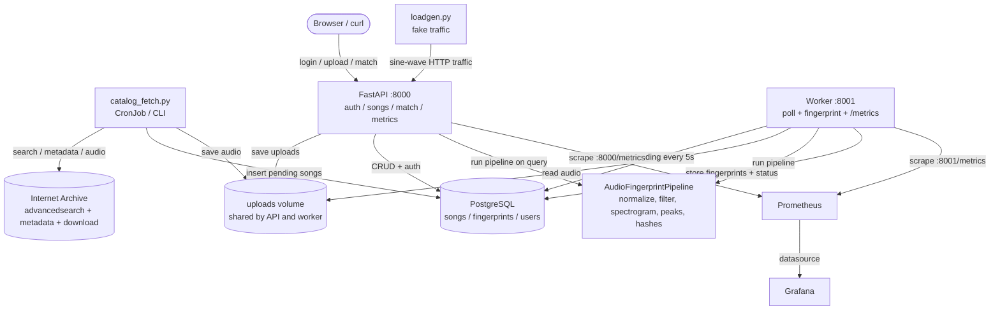

# Shanano — Feature Docs

Explanations of how each Shanano feature works **today** (Iterations 1–3 complete,
Iteration 4 partially implemented: metadata, catalog ingestion, auth, and real
matching are done; the webapp and the K8s catalog CronJob are not).

Each page covers the same four angles so you can compare features easily:

- **Flow** — step-by-step, with a Mermaid diagram
- **Modules** — the files involved and what each one does
- **Triggers** — what starts the feature running
- **Design choices** — why it was built this way

## Feature map

| Feature | Trigger | Read this |
|---|---|---|
| Audio fingerprinting | called by worker & match endpoint | [fingerprinting.md](fingerprinting.md) |
| Song ingestion (upload → worker) | `POST /songs/` + 5s worker poll | [song-ingestion.md](song-ingestion.md) |
| Catalog ingestion (Internet Archive) | `catalog_fetch.py` CLI / CronJob | [catalog-ingestion.md](catalog-ingestion.md) |
| Real matching | `POST /match/` | [matching.md](matching.md) |
| Auth (JWT + roles) | startup seeding, login, protected routes | [auth.md](auth.md) |
| Observability (metrics + logging) | HTTP requests, worker polls, Prometheus scrapes | [observability.md](observability.md) |
| Fake traffic (loadgen) | standalone / compose / K8s Deployment | [loadgen.md](loadgen.md) |

Start with [architecture.md](architecture.md) for the component overview, then
pick a feature.

## System overview

At a high level: audio is **fingerprinted once** by the worker and stored in
PostgreSQL; later, a **query** (uploaded clip) is fingerprinted the same way and
its hashes are looked up against the catalog to find the best matching song.
Prometheus and Grafana observe everything along the way.
