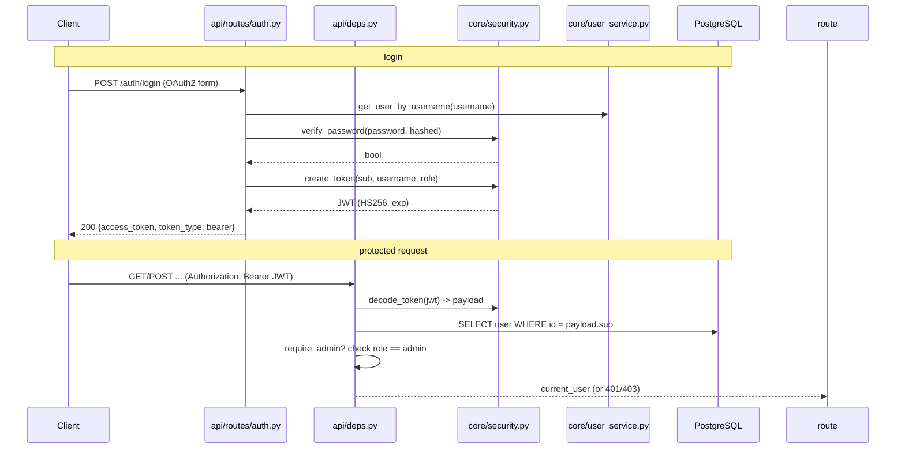

# Auth (JWT + Roles)

Secures the API for a future hosted deployment. JWT (HS256) bearer tokens plus a
two-role model (`admin` / `user`). **There is deliberately no public signup** —
registration is admin-only.

## Flow



## Modules

| Module | Role |
|---|---|
| `core/security.py` | `hash_password`/`verify_password` (bcrypt), `create_token`/`decode_token` (PyJWT, HS256). Enforces the "no hardcoded secret" rule. |
| `core/user_service.py` | `create_user` (hashes before insert), `get_user_by_username`, `seed_users` (startup bootstrap), `UsernameTakenError`. |
| `api/routes/auth.py` | `POST /auth/login`, `POST /auth/register` (admin-only), `GET /auth/me`. |
| `api/deps.py` | `get_current_user` (token → User), `require_admin` (role guard). |
| `core/models.py` | `User` (username, hashed_password, role, created_at). |
| `api/main.py` | `lifespan` calls `seed_users` at startup. |

## Triggers

- **Seeding**: every API startup — creates `admin` (role=admin) and `loadgen`
  (role=user) from env if missing. Idempotent; never overwrites an existing
  password.
- **Login**: `POST /auth/login` — OAuth2 password form (`username`/`password`),
  returns a bearer JWT.
- **Registration**: `POST /auth/register` — requires an admin token.
- **Protection**: any route depending on `get_current_user` / `require_admin`.

## Endpoint protection matrix

| Endpoint | Auth required | Role |
|---|---|---|
| `POST /auth/login` | no | — |
| `GET /health`, `/metrics`, `GET /songs*` | **no** (public) | loadgen + Prometheus need them |
| `POST /songs/` (upload) | yes | any user |
| `POST /match/` | yes | any user |
| `DELETE /songs/{id}` | yes | **admin only** |
| `POST /auth/register` | yes | **admin only** |
| `GET /auth/me` | yes | any user |

## JWT payload

```json
{ "sub": "<user id>", "username": "...", "role": "admin|user",
  "iat": <issued at>, "exp": <expiry> }
```

Expiry defaults to `JWT_EXPIRES_MINUTES` (1440 = 24 h). `decode_token` raises on
any invalid/expired token → `get_current_user` converts that to HTTP 401.

## Design choices

- **No public signup.** Registration is admin-only (a 403 for non-admins, 401 for
  anonymous). This keeps spam out of a future hosted deployment; user creation is
  a privileged operation.
- **bcrypt for passwords** (`core/security.py:28`). Only hashes are ever stored
  or logged. Note the 72-byte bcrypt input limit (truncation guard in code).
- **Secret from env only.** `JWT_SECRET` has **no default** — `create_token`/
  `decode_token` raise `RuntimeError` if it's unset, so a misconfigured
  deployment fails loudly instead of silently using a predictable key.
- **Role checked server-side.** The client sends only the token; every protected
  route re-resolves the user from the DB, so a stale/deleted user immediately
  loses access.
- **Bootstrap users via env.** `ADMIN_USERNAME/PASSWORD` and
  `LOADGEN_USERNAME/PASSWORD` seed accounts at startup (defaults `admin/admin`,
  `loadgen/loadgen` are local-dev only — compose/k8s should override them).
- **Loadgen gap (known).** `loadgen.py` doesn't log in or attach a `Bearer`
  header yet, so its upload/delete/match requests currently get 401s. Wiring
  loadgen into auth is still on the Iteration 4 list (same phase as the webapp).
