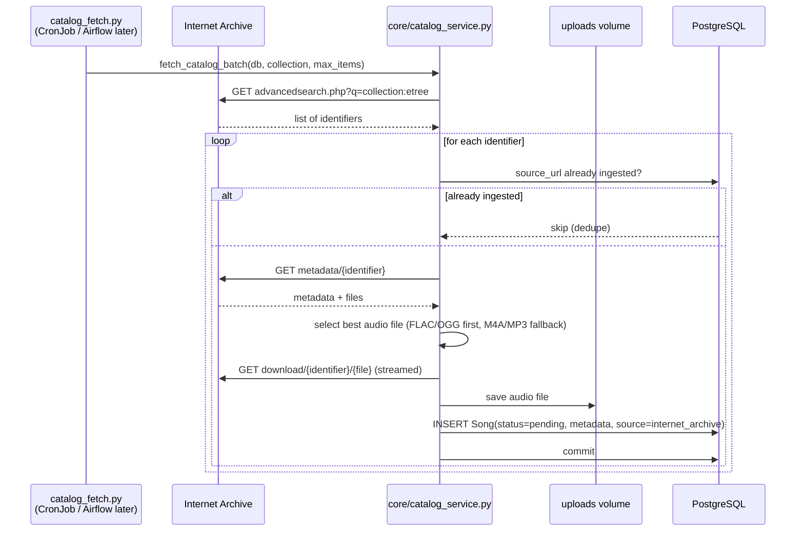

# Catalog Ingestion (Internet Archive)

Populates the catalog automatically from [archive.org](https://archive.org) —
a keyless, public-domain / CC audio source — so the matching feature has real
songs with rich metadata to search against.

## Flow

The loop catches per-item errors so **one bad item never aborts the batch**
(it logs, rolls back, and moves on).

## Modules

| Module | Role |
|---|---|
| `catalog_fetch.py` | Thin CLI wrapper (argparse for `--collection`, `--max-items`) around `fetch_catalog_batch`. Structured so the same function can become an Airflow task later. |
| `core/catalog_service.py` | All the logic: `search_catalog`, `fetch_metadata`, `select_audio_file`, `extract_metadata`, `download_audio`, `_ingest_item`, `fetch_catalog_batch`. |
| `config.py` | `CATALOG_COLLECTION`, `CATALOG_MAX_ITEMS`, IA base URLs, `CATALOG_AUDIO_EXTENSIONS`. |

## Trigger

The `catalog_fetch.py` CLI (or `python -c`/script call) — run manually, from the
Makefile demo, or from a scheduled job. The spec intends a Kubernetes CronJob to
run it on a schedule; that manifest is not written yet. The function signature is
deliberately Airflow-friendly (`fetch_catalog_batch(db, collection, max_items,
client, upload_dir)` — `client`/`upload_dir` are injectable for tests).

## IA metadata extraction

IA metadata fields are often lists (multiple creators/subjects) — `_join_values`
joins them with `", "`. The free-form `date` field is parsed for a 4-digit year
by regex (`_extract_year`). Cover art is a constructed URL:
`https://archive.org/services/img/{identifier}`.

The **audio file pick** (`select_audio_file`) follows the spec's preference
order: lossless `FLAC/OGG` first, `M4A/MP3` as fallback — a deliberate trade-off
between audio quality and download size given the serial worker.

## Dedupe

Dedupe key is `source_url` (`https://archive.org/details/{identifier}`), which is
indexed in the DB. Re-running the batch is therefore idempotent: already-seen
items log `"catalog item already ingested, skipping"` and return 0.

## Design choices

- **Keyless, safe source.** Internet Archive needs no API key and hosts public
  domain / CC audio — ideal for a learning project. Default collection `etree`
  (Live Music Archive) has rich metadata (artist, album, year, genre, cover).
- **Self-contained async batch.** `fetch_catalog_batch` is one callable unit →
  reusable as a plain CronJob command today and an Airflow task later without
  rework.
- **Songs enter the normal pipeline.** Inserted as `status=pending`, so the same
  worker that processes user uploads fingerprints catalog audio — one code path
  for all ingestion.
- **Per-item fault isolation.** `try/except` + `db.rollback()` per item keeps a
  single dead item from blocking an entire batch.
