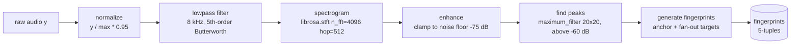

# Audio Fingerprinting

The heart of Shanano. Turns a raw audio waveform into a list of **fingerprints**
— compact hashes derived from spectral peaks — that are time-invariant enough to
survive cutting a clip out of a longer recording.

## Flow

Implemented in `audio_pipeline.py:AudioFingerprintPipeline.run` (a plain
synchronous function over a numpy array — it never touches the DB).

### Step details

1. **Normalize** (`audio_pipeline.py:35`) — scale to 95 % of peak amplitude so
   fingerprinting is volume-independent.
2. **Lowpass** (`audio_processing/audio.py:35`) — zero-phase Butterworth
   (5th-order `filtfilt`) at 8 kHz. Removes high-frequency content that is
   mostly noise and irrelevant to the human ear.
3. **Spectrogram** (`audio_processing/spectrogram.py:7`) — STFT via
   `librosa.stft` (n_fft 4096, hop 512), magnitude, converted to dB
   (`amplitude_to_db`).
4. **Enhance** (`audio_pipeline.py:48`) — `np.maximum(S_db, -75)` raises the
   noise floor so quiet noise doesn't create spurious peaks.
5. **Find peaks** (`audio_processing/spectrogram.py:13`) — a 20×20 maximum
   filter marks local maxima; keep only peaks above −60 dB. Each peak is a
   `(time_frame, freq_bin)` pair.
6. **Generate fingerprints** (`controllers/fingerprint.py:4`) — for each
   **anchor** peak, look at the next `FAN_OUT` (15) peaks as **targets**; if the
   time gap `delta_t = t2 - t1` is within `MIN_TIME_DELTA=1`..`MAX_TIME_DELTA=200`
   frames, emit a fingerprint.

A fingerprint is a 5-tuple: `(hash, anchor_time, anchor_freq, target_time,
target_freq)`, where the **hash is `SHA1(f"{f1}|{f2}|{delta_t}")` truncated to
20 hex chars** (`controllers/fingerprint.py:21`).

## Modules

| Module | Responsibility |
|---|---|
| `audio_pipeline.py` | Orchestrates steps 1–6; stores checkpoints of every intermediate for debugging. |
| `audio_processing/audio.py` | `load_audio` (librosa decode, mono, resample to 22050), Butterworth filters. |
| `audio_processing/spectrogram.py` | `spectrogram` (STFT → dB), `find_peaks` (maximum-filter peak picking). |
| `controllers/fingerprint.py` | `generate_fingerprints` (fan-out pairing), `hash_peak_pair` (SHA-1 hash). |
| `config.py` | `FAN_OUT`, `MIN_TIME_DELTA`, `MAX_TIME_DELTA`, sample rate, hop length, thresholds. |

## Triggers

The pipeline itself is pure — it is **invoked by**:

- `core/song_service.py:process_song` — the worker indexing a catalog song, and
- `api/routes/match.py:match_audio_endpoint` — fingerprinting a query clip.

Nothing else calls it. Keeping it pure means both paths share identical DSP and
a clip can only match songs that were fingerprinted the same way.

## Design choices

- **Fan-out hashing (Shazam-style).** Each anchor pairs with its 15 nearest
  temporal targets. The hash only encodes frequencies + *relative* time
  (`delta_t`), never the absolute anchor time — so a clip starting at a random
  offset produces the **same hashes** as the full song, and the absolute times
  become the "votes" that matching uses (see [matching.md](matching.md)).
- **Hashing by SHA-1 truncation** is fast and collision-resistant enough for a
  learning project; the truncated 20-hex prefix keeps rows small.
- **Time-delta window** (1–200 frames) prunes near-simultaneous pairs (no
  information) and far-apart pairs (rare to survive clipping).
- **Noise-floor clamp + −60 dB peak threshold** filter out quiet, unstable
  peaks, keeping the fingerprint set deterministic and stable.
- **Checkpoints on the pipeline instance** (`run()` stores `raw/normalized/
  lowpass/spectrogram/enhanced/peaks/fingerprints`) — handy for the Jupyter
  notebook walkthroughs.
