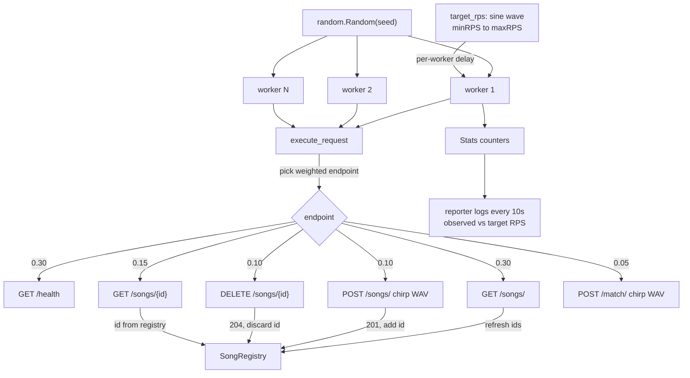

# Fake Traffic Generator (loadgen)

Simulates a population of users hitting the API so Prometheus metrics and the
Grafana dashboard visibly **go up and down** instead of showing a flat line.

## Flow

Each worker loops: pick an endpoint (weighted random), fire the request, record
its status, then sleep a duration proportional to `workers / current_target_rps`
so the aggregate rate tracks the sine wave.

## Modules

| Module | Role |
|---|---|
| `loadgen.py` | Everything: config (`LoadgenConfig` from CLI/env), `target_rps` sine wave, `generate_chirp_wav` (synthetic audio), `SongRegistry` (known song ids), `Stats`, `worker`/`reporter` tasks, `run`. |
| `core/logging.py` | structured logging (`loadgen` context). |

## Triggers

Standalone CLI, `docker compose up -d loadgen`, or the K8s `loadgen` Deployment.
Flags/env: `LOADGEN_TARGET`, `LOADGEN_WORKERS`, `LOADGEN_MIN_RPS`,
`LOADGEN_MAX_RPS`, `LOADGEN_WAVE_PERIOD`, `LOADGEN_DURATION`, `LOADGEN_SEED`,
`LOADGEN_USERNAME`, `LOADGEN_PASSWORD`.

## Design choices

- **Authenticates as the seeded loadgen account.** Since Iteration 4 made
  `POST /songs/` (any authed user) and `DELETE /songs/{id}` (admin-only)
  auth-protected, loadgen logs in once at startup via `POST /auth/login` with
  `LOADGEN_USERNAME`/`LOADGEN_PASSWORD` (retrying for ~30s to survive the
  compose/k8s startup race) and then sends the bearer token on every request.
  Public endpoints (`health`, `list`, `get`, `match`) simply ignore it.
  The loadgen user is seeded as an **admin** (`core/user_service.py`) so the
  delete endpoint is exercised too, not just uploads.
- **Sine-wave request rate.** `target_rps(t)` oscillates between
  `LOADGEN_MIN_RPS` and `LOADGEN_MAX_RPS` over `LOADGEN_WAVE_PERIOD` seconds, so
  dashboards "breathe" — you can visually confirm Prometheus/Grafana are working.
- **Weighted endpoint mix** mirrors a real user population (browsing >> mutating),
  and uploads are included so the worker gets genuine work to process.
- **Synthetic chirp WAVs.** Frequency-swept sine waves generated in-memory
  (`generate_chirp_wav`) — no audio assets needed, deterministic, and they
  produce real spectral peaks that the pipeline can fingerprint.
- **SongRegistry** tracks which song ids exist so `get`/`delete` target real rows
  (falling back to `list` when the catalog is empty) instead of spraying 404s.
- **Seeded randomness** (`LOADGEN_SEED`) makes runs reproducible.
