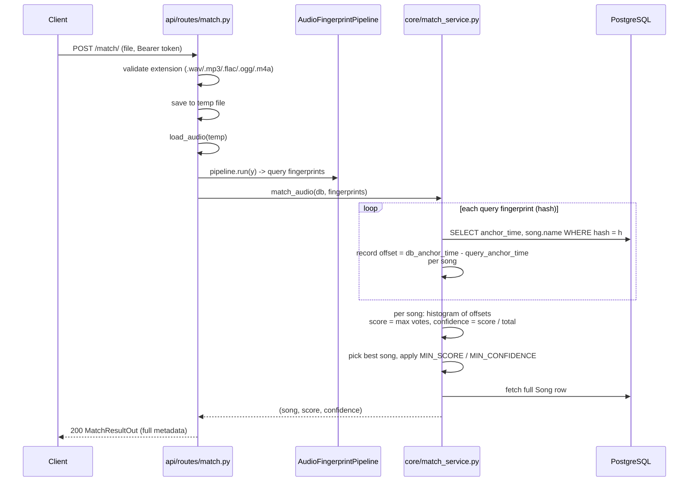

# Matching

Given an uploaded audio clip, find the best catalog song it belongs to and
return full metadata. Implemented as an async SQLAlchemy port of the original
SQLite `controllers/match_service.py` — same algorithm, different storage.

## Flow

The algorithm runs after the query audio is fingerprinted. Note the current
endpoint saves the upload to a temp file first; **this is the target of
[ADR-0001](decisions/0001-client-sends-wav-for-match.md)** — since we build the
client and it always sends WAV, the endpoint will instead decode from an
in-memory `io.BytesIO` and drop the temp file entirely. The matching core below
is untouched by that change; it only ever sees fingerprints.

## The algorithm (3 steps)

1. **Hash lookup** (`core/match_service.py:match_fingerprints`) — for every
   query fingerprint hash, query catalog `fingerprints` (joined to `Song`) with
   the same hash. Record `db_anchor_time - query_anchor_time`.
2. **Offset voting** — per candidate song, build a histogram of those offsets.
   The correct song peaks at a *single* offset (the clip's start position in the
   song); wrong songs scatter their votes. `score` = the tallest histogram bin.
3. **Best candidate** — sort candidates by `(score, total_matches)`, take the
   top. Then `match_audio` applies acceptance thresholds and loads the full
   `Song` row.

## Acceptance thresholds (`config.py`)

| Threshold | Default | Meaning |
|---|---|---|
| `MATCH_MIN_SCORE` | 2 | Minimum offset-vote count for a candidate. Blocks a single spurious hash collision (score 1) from matching. |
| `MATCH_MIN_CONFIDENCE` | 0.2 | Fraction of matched fingerprints voting for the winning offset. Guards against a song that shares *many* hashes but no consistent offset. |

Both must clear for a match; otherwise `NoMatchFoundError` → HTTP 404
`"No match found"`.

## Modules

| Module | Role |
|---|---|
| `api/routes/match.py` | Endpoint: validate, save temp, decode, fingerprint, call service, map result → `MatchResultOut`. Cleans up the temp file in `finally`. |
| `core/match_service.py` | `match_fingerprints` (lookup + voting), `match_audio` (thresholds + Song fetch), `get_matching_fingerprints_in_song` (helpers). |
| `controllers/match_service.py` | The SQLite reference implementation this is ported from. |
| `config.py` | `MATCH_MIN_SCORE`, `MATCH_MIN_CONFIDENCE`, `SUPPORTED_AUDIO_EXTENSIONS`. |
| `core/schemas.py` | `MatchResultOut` — song name, score, confidence, and all catalog metadata. |

## Trigger

`POST /match/` by any authenticated user. The query clip is fingerprinted with
the exact same `AudioFingerprintPipeline` used to index catalog songs — this
consistency is what makes the hashes comparable.

## Design choices

- **Client always sends WAV (ADR-0001).** Because we control the client, match
  queries are WAV 16-bit PCM, so the endpoint can decode from an in-memory
  `BytesIO` — no named temp file. This works because matching is format-agnostic:
  `load_audio` normalizes both catalog and query to mono 22050 Hz float32, and
  the peak hashes survive codec differences. Catalog MP3/FLAC entries match WAV
  queries fine; server-side decoding of catalog audio is unaffected.
- **Faithful port, not a rewrite.** The SQLite algorithm is preserved 1:1 so
  the correctness already proven in the CLI still holds; only the storage layer
  (cursor → async ORM) changed.
- **Offset voting is the signal.** Because fingerprints hash *relative* times,
  absolute anchor times become the votes. One dominant offset ⇒ confident match;
  diffuse votes ⇒ reject.
- **Confidence as a second gate.** `score ≥ 2` alone is too weak — a song with
  heavy hash overlap could pass. `confidence` (votes for the winning offset ÷
  total matched hashes) adds a structural test that a real match must pass.
- **N+1 hash queries.** Each query hash triggers one DB `SELECT ... WHERE
  hash = ...`. Identical to the reference, simple, and fine at catalog scale —
  a candidate optimization if the catalog grows (batch IN-clause lookups).
- **Return metadata, not just an ID.** `MatchResultOut` carries artist/album/
  year/genre/cover art so the webapp can render a full result card (see
  [auth.md](auth.md) for the auth gate).
