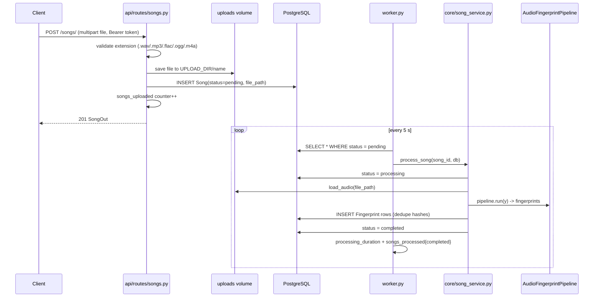

# Song Ingestion (Upload → Worker → Fingerprints)

How a song gets into the catalog and ends up fingerprinted. Two actors: the
**API** (accepts the file, queues the song) and the **worker** (does the heavy
lifting asynchronously).

## Flow



On failure the song is marked `failed` and the exception is swallowed by the
worker loop so one bad file doesn't kill the poll.

## Modules

| Module | Role in this flow |
|---|---|
| `api/routes/songs.py` | `POST /songs/` (auth required), `GET /songs/` (list + fingerprint count), `GET /songs/{id}`, `DELETE /songs/{id}` (admin-only). |
| `core/song_service.py` | `process_song` — the state machine + fingerprint persistence. |
| `worker.py` | Poll loop, per-song timing, error handling, metrics. |
| `core/models.py` | `Song` (status machine), `Fingerprint` (composite PK `(hash, song_id)`). |
| `config.py` | `SUPPORTED_AUDIO_EXTENSIONS`, `UPLOAD_DIR`. |
| `core/metrics.py` | `songs_uploaded`, `songs_processed{status}`, `processing_duration`. |

## Triggers

- **Upload**: `POST /songs/` by any authenticated user. The extension must be in
  `SUPPORTED_AUDIO_EXTENSIONS` (`.wav .mp3 .flac .ogg .m4a`); the check is by
  filename suffix, so a mislabeled file still gets queued and fails later in the
  worker.
- **Processing**: the worker's 5-second poll finds rows with `status=pending`.
  Catalog-ingested songs enter the same queue this way (see
  [catalog-ingestion.md](catalog-ingestion.md)).

## The status state machine

```
pending → processing → completed
                ↘ failed
```

This column *is* the job queue: the API only ever writes `pending` (and catalog
ingestion too); the worker is the only component that flips statuses. Listing
songs is a plain `GROUP BY` count of fingerprints, so `GET /songs/` shows how
far processing has gotten.

## Design choices

- **DB-as-job-queue.** No broker: the `status` column + poll gives a durable,
  simple queue. Right-sized for a serial worker; Kafka (Iteration 5) replaces it
  when parallelism and ordering matter.
- **Shared uploads volume.** The API saves bytes, the worker reads them from the
  same volume — no re-upload over the network and no embedding file bytes in the
  DB.
- **Dedupe by hash within a song.** Because `fingerprints` has a composite PK
  `(hash, song_id)`, identical repeated peak-pairs would collide; `song_service`
  keeps a `seen` set and inserts each hash once.
- **Worker is serial and single-instance.** The DSP is CPU-bound (numpy/librosa)
  and the current design trades throughput for simplicity; scaling to multiple
  workers is an Iteration 5 concern.
- **Per-song metrics.** `processing_duration` histogram + `songs_processed`
  counter let Grafana show processing rate and p99 latency (see
  [observability.md](observability.md)).
