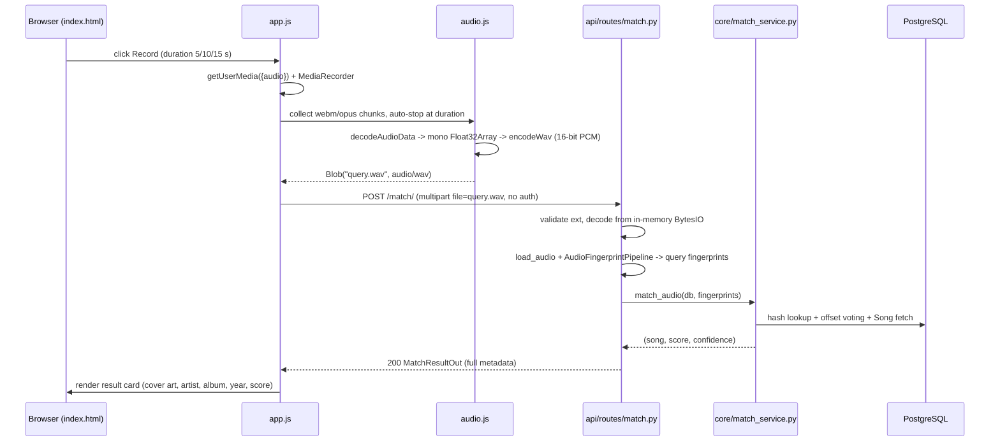

# Webapp — Mic-only Match Client

- **Status**: Implemented
- **Date**: 2026-08-02
- **Scope**: a minimal, same-origin web client for matching recorded audio against
  the catalog. Mic-only; no login; no file upload.

## Goal

Anyone opens the app, records ~5–15 s of music from their microphone, and gets the
matching catalog song with full metadata — like Shazam, but without an account.
Matching is anonymous: `POST /match/` is public and the app sends no token.

## Flow

## Files

| File | Role |
|---|---|
| `webapp/index.html` | single page: title, Record button, duration picker, status line, result card, error area |
| `webapp/styles.css` | simple, clean, responsive styling |
| `webapp/app.js` | mic lifecycle, `fetch("/match/")`, render result/error states |
| `webapp/audio.js` | MediaRecorder capture, `OfflineAudioContext` decode, mono downmix, WAV encoding |
| `api/main.py` | mounts the static dir with `StaticFiles` (registered last, so API routes win) |
| `api/routes/match.py` | public `POST /match/` (no `get_current_user` dependency) |

All plain ES modules — `index.html` loads `app.js` with
`<script type="module" src="app.js">`. No build step, no dependencies.

## Behavior

1. Click **Record** → `navigator.mediaDevices.getUserMedia({ audio: true })` →
   `MediaRecorder(stream)` (prefers `audio/webm;codecs=opus`, falls back to the
   default mime type).
2. Chunks are collected on `dataavailable`; recording auto-stops after the chosen
   duration (or on **Stop**).
3. On stop the mic tracks are always released, the blob is decoded with
   `decodeAudioData`, mixed down to a mono `Float32Array`, and encoded to 16-bit
   PCM WAV via `encodeWav`.
4. `fetch("/match/", { method: "POST", body: formData })` is sent with **no**
   `Authorization` header.
5. A "Matching…" state shows while awaiting the response; a result card renders
   cover art, song name, artist · album · year, genre, score + confidence, and a
   link to the source.

The recording is lossy (opus/webm), but fingerprints are codec-robust — both
catalog and query are normalized to mono 22050 Hz float32 before
fingerprinting — so matching still works.

## API contract

| Endpoint | Method | Auth | Body | Success | Errors |
|---|---|---|---|---|---|
| `/match/` | POST | none | multipart `file=query.wav` (audio/wav) | 200 `MatchResultOut` | 400 "Unsupported audio format" / "Could not decode audio file"; 404 "No match found" |

`MatchResultOut` fields the app renders: `song_name`, `artist`, `album`, `year`,
`genre`, `cover_art_url`, `score`, `confidence`, `source`, `source_url`.

## Error handling

- **404** → "No match found".
- **400** → "Could not decode that recording (or unsupported format)".
- **Network error / fetch throws** → "Could not reach the server".
- **`getUserMedia` denied** → a message explaining mic permission is required.
- **`decodeAudioData` fails** → treated like the 400 case.
- Every failure resets the Record button to idle and re-enables recording.

## Design choices

- **Same-origin, no build step.** The app is static HTML/CSS/vanilla JS served by
  FastAPI itself via `StaticFiles`. No npm, no bundler, no CORS (same origin).
- **Mic-only (no file upload).** The webapp never accepts files from the user; the
  only audio source is `getUserMedia`. This keeps the abuse surface small.
- **WAV queries (ADR-0001).** The browser always sends 16-bit PCM mono WAV named
  `query.wav`, because the server decodes match queries from an in-memory
  `io.BytesIO` (no temp file).
- **Public matching.** `POST /match/` requires no auth; no other endpoint changed.
  Auth stays in place for everything else.

## Tests

- `tests/integration/test_webapp.py` — static files are served (`/`, `/app.js`,
  `/audio.js`, `/styles.css`) while `/health`, `/docs`, `/metrics` still win over
  the mount; anonymous `POST /match/` returns 400 (reachable without a token).
- `tests/integration/test_match_api.py` — verifies anonymous access to the match
  endpoint.

## References

- `api/routes/match.py` — the public match endpoint
- `api/main.py` — the `StaticFiles` mount
- `config.py` — `SUPPORTED_AUDIO_EXTENSIONS`
- `core/schemas.py` — `MatchResultOut`
- `docs/decisions/0001-client-sends-wav-for-match.md` — why match queries are WAV
